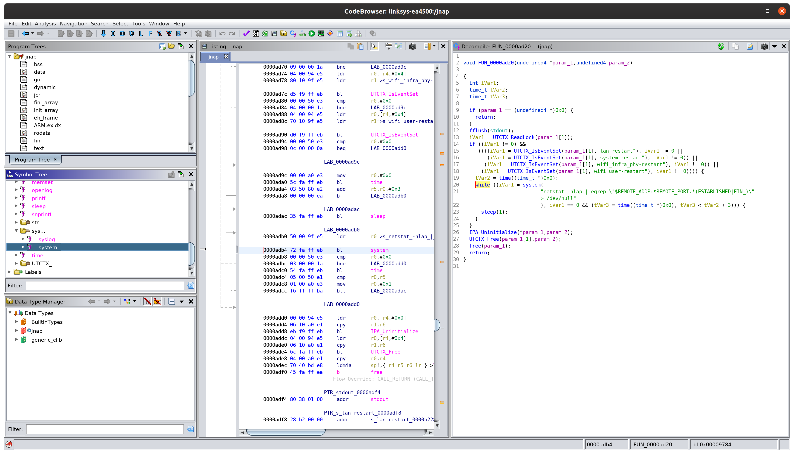
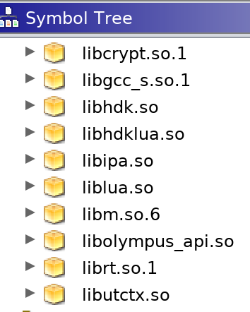

# Linksys EA4500 v1.0 Write Up

Published: March 24, 2020

**tl;dr: I was not able to identify any command injection vulnerabilities that might let me take control of the router.**

## Firmware
The firmware is available [here](https://downloads.linksys.com/downloads/firmware/FW_EA4500_2.1.42.183584_prod.img).  The support page for this product is [here](https://www.linksys.com/us/support-article?articleNum=148385).  The latest firmware build for hardware version 1.0 is `2.1.42` which was released `9/19/2017`.  According to [here](https://www.linksys.com/us/support-article?articleNum=291976) this device was EOL'd in May 2014.

The dynamic portions of the web interface are handled by the `/usr/sbin/jnap` binary. There is exactly one instance of the `system` function in the entire binary:



This function is invoked whenever the LAN is restarted or when the device is rebooted, amongst others. The code looks something like this:

```c++
    while ((iVar1 = system(
      "netstat -nlap | egrep \"$REMOTE_ADDR:$REMOTE_PORT.*(ESTABLISHED|FIN_)\"> /dev/null"
      ), iVar1 == 0 && (tVar3 = time((time_t *)0x0), tVar3 < tVar2 + 3))) {
        sleep(1);
    }
```

Unfortunately CGI does not take the `$REMOTE_ADDR` or the `REMOTE_PORT` environment variable from the HTTP `Host` header, otherwise we might be able to exploit this!

Since this binary is not going to get us where we need to be, I decide to check out the web root on the firmware filesystem.  The webroot is at `/www`, but all the interesting things are at `/www/ui/cgi/`:

```bash
$ ls -l /www/ui/cgi/
bootloader_info.cgi*  get_counter_info.cgi*  getstinfo.cgi*  jcgi.cgi*  localize.cgi*  qos_info.cgi*  speedtest_info.cgi*  sysinfo.cgi*  usbinfo.cgi*
```

Then I run:

```bash
$ file /www/ui/cgi/*
www/ui/cgi/bootloader_info.cgi:  POSIX shell script, ASCII text executable
www/ui/cgi/get_counter_info.cgi: ASCII text
www/ui/cgi/getstinfo.cgi:        POSIX shell script, ASCII text executable
www/ui/cgi/jcgi.cgi:             a /usr/bin/lua script, ASCII text executable
www/ui/cgi/localize.cgi:         a /usr/bin/lua script, ASCII text executable
www/ui/cgi/qos_info.cgi:         POSIX shell script, ASCII text executable
www/ui/cgi/speedtest_info.cgi:   POSIX shell script, ASCII text executable
www/ui/cgi/sysinfo.cgi:          POSIX shell script, ASCII text executable
www/ui/cgi/usbinfo.cgi:          POSIX shell script, ASCII text executable
```

It looks like we have some CGI shell scripts and some CGI Lua scripts.  Let's take a look at the shell scripts first.

## CGI Shell Scripts

What we are really interested in here is the HTTP POST body and the `$QUERY_STRING` environment variable.  The HTTP POST body in CGI will come in as the first argument to the CGI shell script, so we are looking for `$1` in that case.  Let's do some grepping:

```bash
$ grep -rn '$1' /www/ui/cgi
www/ui/cgi/sysinfo.cgi:16:  if [ "$1" == "" ] ; then
www/ui/cgi/sysinfo.cgi:20:  form_var="$1"
www/ui/cgi/usbinfo.cgi:5:if [ "$1" = "" ]; then
```

Let's look at `www/ui/cgi/sysinfo.cgi` first.  The interesting portion of this file is near the top:

```sh
 get_cgi_val () {
   if [ "$1" == "" ] ; then
     echo ""
     return
   fi
   form_var="$1"
   var_value=`echo "$QUERY_STRING" | sed -n "s/^.*$form_var=\([^&]*\).*$/\1/p" | sed "s/%20/ /g" | sed "s/+/ /g" | sed "s/%2F/\//g"`
   echo -n "$var_value"
 }
```

This shell function uses the `$QUERY_STRING` and `$1` POST body parameters. Unfortunately there is no string concatenation happening, so we are not able to inject shell meta-characters into the command.

Next's let's move on to `www/ui/cgi/usbinfo.cgi`.  The interesting portion of the code is here:
```sh
if [ "$1" = "" ]; then 
   echo Content-Type: text/plain
   echo ""
 fi
```

This is a non-starter because the `$1` HTTP POST parameter is not passed to any sub-command invocation or otherwised used.

## CGI Lua Scripts
There are also two lua scripts in the `/www/ui/cgi` directory:

```sh
www/ui/cgi/jcgi.cgi:             a /usr/bin/lua script, ASCII text executable
www/ui/cgi/localize.cgi:         a /usr/bin/lua script, ASCII text executable
```

Let's once again do some grepping.  This time we will want to look for the system command invocation in lua, which is `os.execute`:

```bash
$ grep -rn 'os.execute' www/ui/cgi
www/ui/cgi/jcgi.cgi:99:                verify(os.execute(cmd) == 0, 'ErrorCreatingArchiveFile')
www/ui/cgi/jcgi.cgi:153:                verify(os.execute(cmd) == 0, 'ErrorExtractArchiveFailed')
```

Let's look at `jcgi.cgi` in more detail.  There seems to be two different operating system command invocations in this CGI Lua script. The first one looks like this:

```lua
local cmd = 'tar -zcf ' .. tmpFilePath
for i = 1, #backupPaths do
    cmd = cmd .. ' ' .. backupPaths[i]
end
cmd = cmd .. ' > /dev/null 2>&1'
-- Print the command and create a fake archive file if we're debugging
if os.getenv('JCGI_DEBUG') then
    print(cmd)
    local archiveFile = io.open(tmpFilePath, 'w')
    archiveFile:write('A fake tar.gz file')
    archiveFile:close()
else
     verify(os.execute(cmd) == 0, 'ErrorCreatingArchiveFile')
end
```
This function does use string concatenation to build its command string payload, namely using the `tmpFilePath` variable.  However, the value for this variable is defined on line 23:
```lua
local tmpFilePath = os.getenv('JCGI_DEBUG') and 'jcgi.tmp' or '/tmp/var/config/jcgi.tmp'
```

Even if we could inject the `JCGI_DEBUG` environment variable into the process, defining it would cause program execution to skip the `os.execute` function invocation.

Moving on to the second occurance of `os.execute` on line 153:

```lua
local archiveFile = io.open(tmpFilePath, 'w')
verify(archiveFile, 'ErrorWritingArchiveFile')
verify(archiveFile:write(archiveBuffer), 'ErrorWritingArchiveFile')
archiveFile:close()

-- Now delete the old IPA cache, extract the achive, and lock out the
-- IPA database until the device reboots so that we don't end up with
-- duplicate entries
local cmd = 'rm -rf ' .. ipaCachePath .. ' && cd / && tar -xzf ' .. tmpFilePath .. ' tmp/syscfg.tmp var/config/ipa && touch /tmp/ipa/.lockedout > /dev/null 2>&1'

-- Just print the command if we're debugging
if os.getenv('JCGI_DEBUG') then
    print(cmd)
else
    verify(os.execute(cmd) == 0, 'ErrorExtractArchiveFailed')

```

So in this case there are three variables which could be used to inject commands into: `tmpFilePath` , `ipaCachePath`.  We already know from the first example that `tmpFilePath` is a no go, but let's take a look at `ipaCachePath`:

```lua
local ipaCachePath  = '/var/config/ipa'
```

Unforunately this value is hard coded on line 21 to the value `/var/config/ipa` so there is no injection opportunity with this variable.  

The last potential injection point is in the variable `backupPaths`, which is defined on line 21:

```lua
local backupPaths = {ipaCachePath, tmpSyscfgPath}
```
We know `ipaCachePath` is a no-go but we need to look now at `tmpSyscfgPath`. It is defined on line 22:
```lua
local tmpSyscfgPath = '/tmp/syscfg.tmp'
```
Another hard coded value.  At this point we know that this instance of `os.execute` is not vulnerable to command injection.

At this point we have exhausted the contents of `/www/ui/cgi`.

There are additional lua files in `/JNAP/modules/`. However, they are all in Lua bytecode format.  I attempted to decompile them back to Lua and had less than optimal results.  

## Analysis

The usage of a scripting language (lua) to handle most of the dynamic web interface resulted in device firmware that was far more difficult to exploit than some of the other older models of Linksys routers.  the `/usr/sbin/jnap` binary offloads input processing to lua by loading shared objects than then load the lua bytecode in `/JNAP/modules`.



Combined with the lack of a telnet daemon, command injection is not the best approach to penetrating this device.  Looking for memory corruption bugs in the `jnap` binary would most likely be more fruitful, but then you have the problem of trying to write an exploit for a device that you don't have 1) a shell on and 2) a compiler toolchain for.  It's not impossible, just very diffficult. 